# 基于图神经网络的AD分类研究

#### Update

+ **2024.03.20:尝试重新使用FREESURFER处理脑部数据**

+ **2024.02.02:完整的workflow.sh**:lantern:

+ **2024.01.28:resNet18(acc:0.7)**:aerial_tramway:

+ **2024.01.22:数据处理流程化,尝试已实现方法**:melon:

+ **2024.01.15:背景调查,以及数据预处理**:notebook:

#### TODO

- [x] 基本的数据预处理

- [ ] 常见的神经网络模型

  + Multilayer_Perceptron

  + resNet
  + LeNet
  + AlexNet
  + VGG

- [ ] 图神经网络

#### Tools

```latex
python==3.10.8
itksnap-4.0.2-20230925-Linux-gcc64
fsl python2
```

#### Dataset

```latex
git clone git@github.com:Justin-12138/Gradesign.git
cd Gradesign/ADNI
chmod +x workflow.sh
./workflow.sh
```

+ 数据集介绍

  ```latex
  https://adni.loni.usc.edu/methods/mri-tool/mri-analysis/#mri-pre-processing-container
  ```

+ 数据预处理

  + 从ADNI下载数据集
    ```latex
    https://adni.loni.usc.edu
    ```

  + 原始图像

    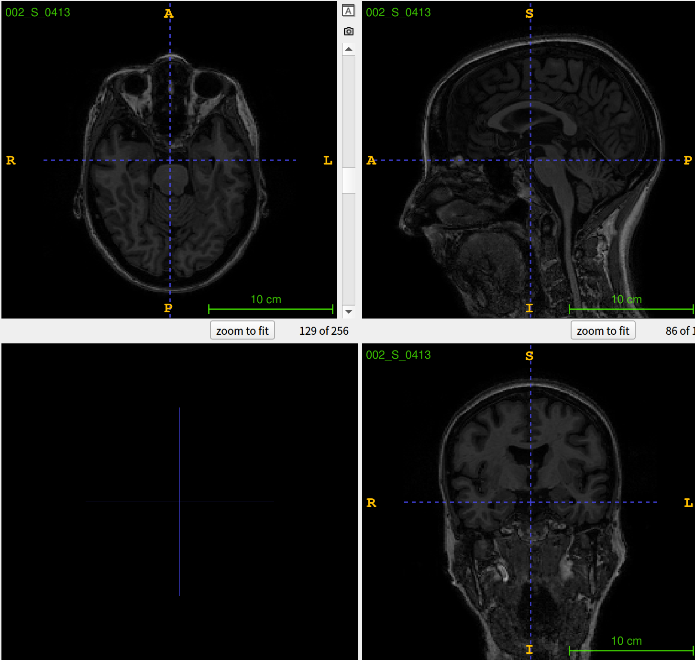

  + 颅骨剥离

    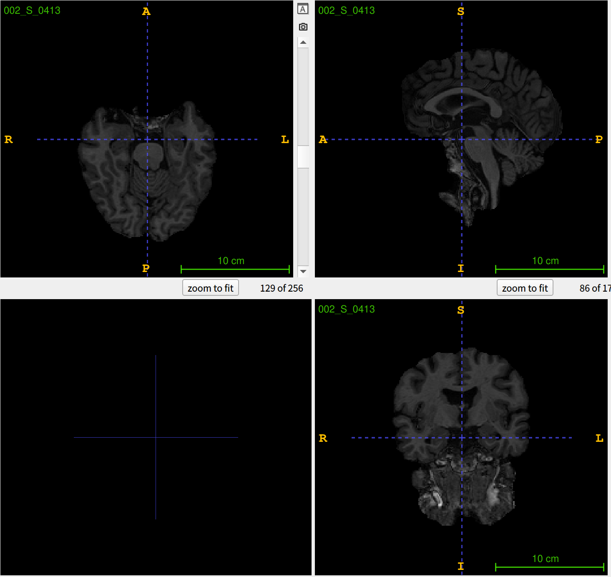

    

  + 配准(182x218x182)

  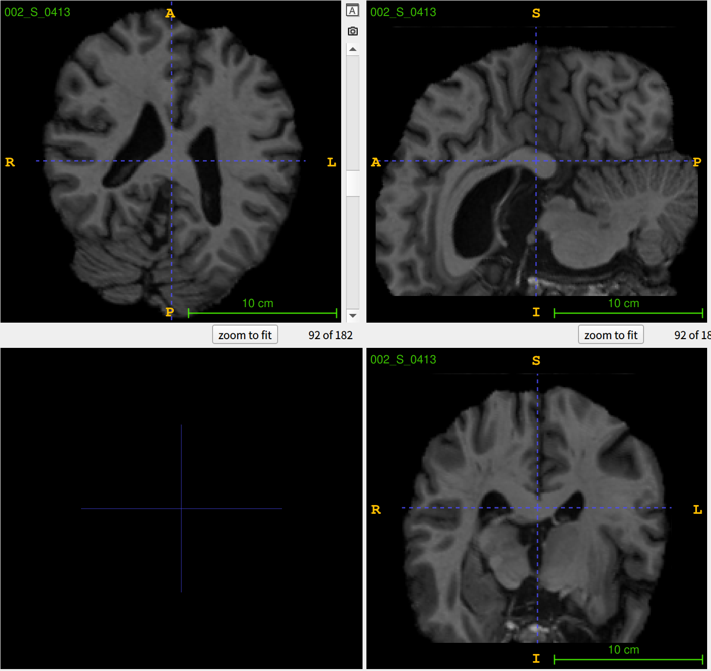

  + 高斯平滑

  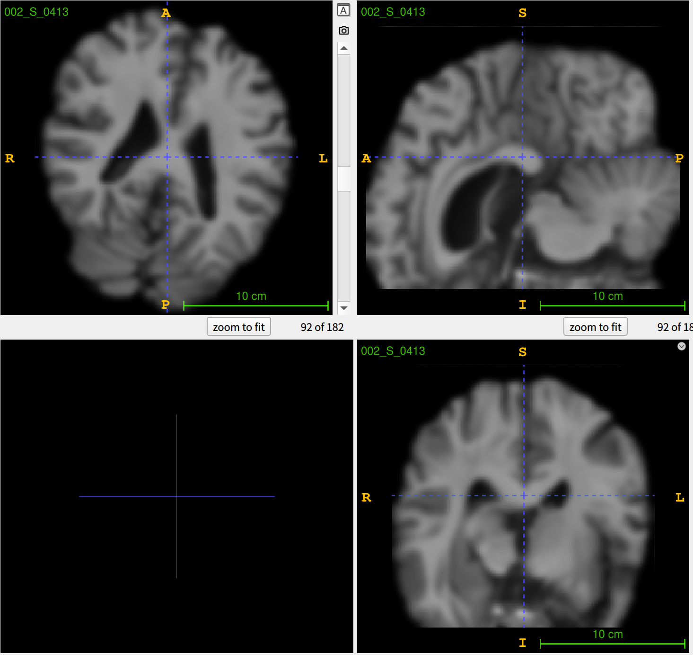

  

  + 灰度归一化(使用fsleyes展示，itksnap只支持16位精度)

    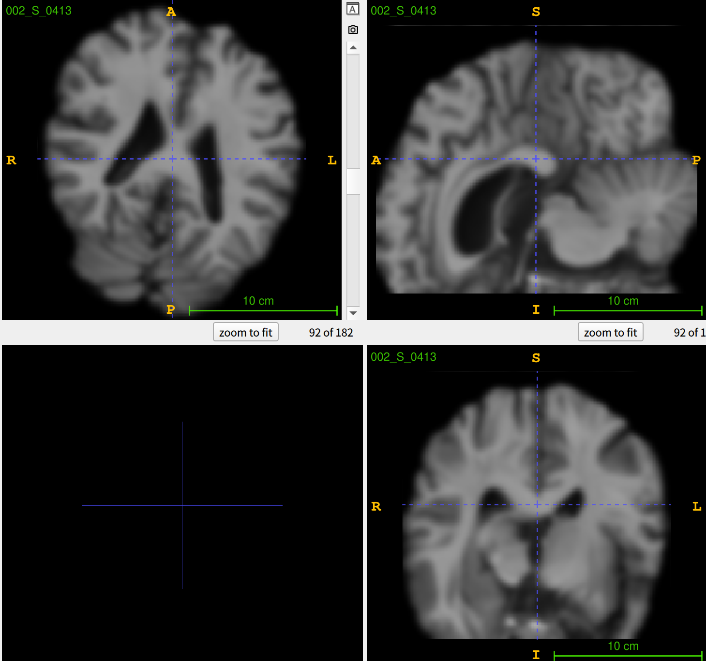

  + 切片(182x218x182)
    
    90,100,90
    
    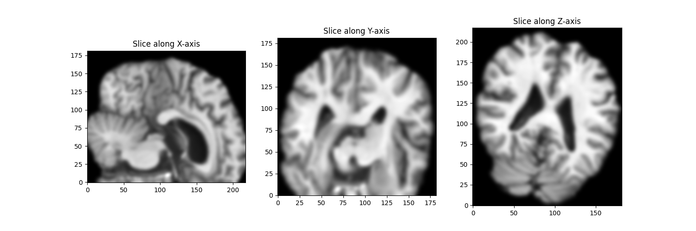
    
    9,18,9
    
    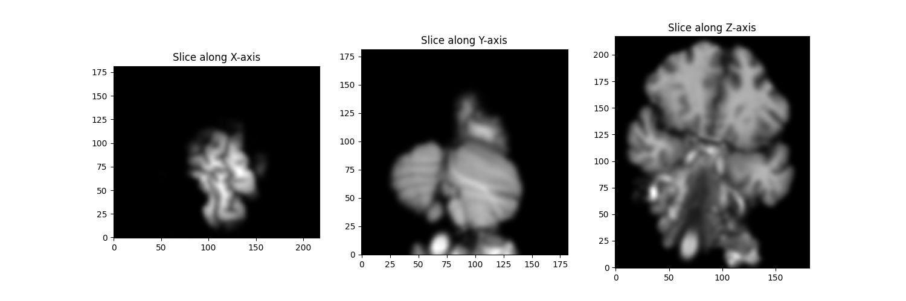
    
    170,200,170
    
    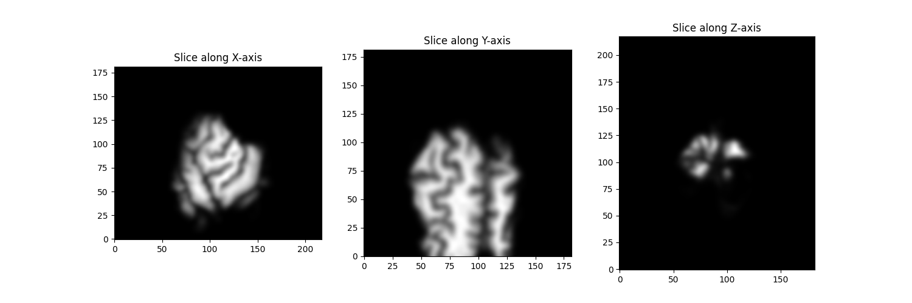


  + **切片**

    + ***x轴切片***
      **AD**
    
      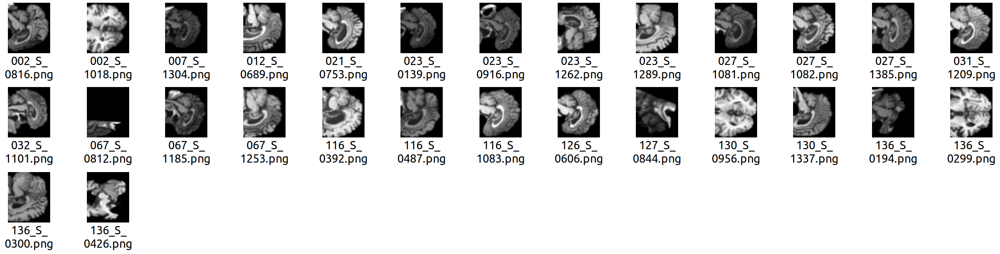
    
    
      **CN**
    
      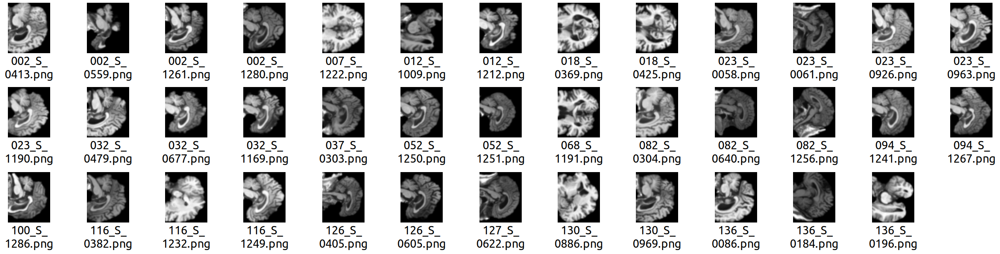
    
      **MCI**
    
      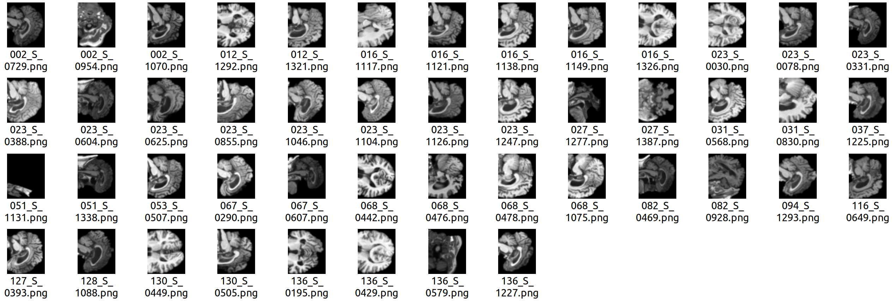
    
    + ***y轴切片***
    
      **AD**
    
      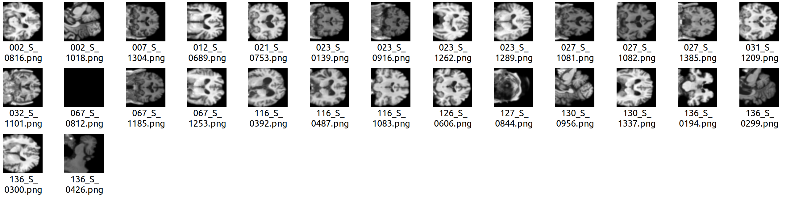
    
      **CN**
    
      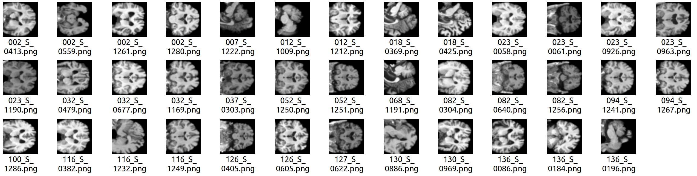
      **MCI**
    
      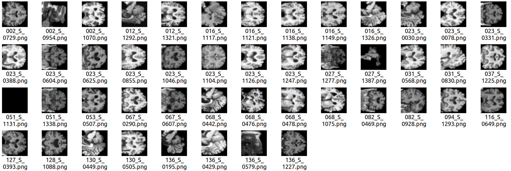
    
    + ***z轴切片***
      **AD**
    
      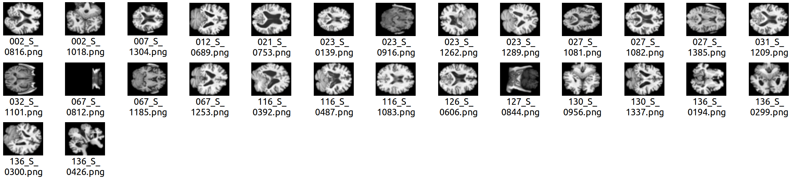
      **CN**
    
      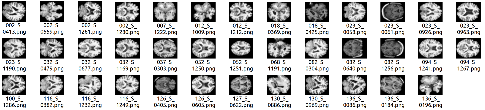
      **MCI**
    
      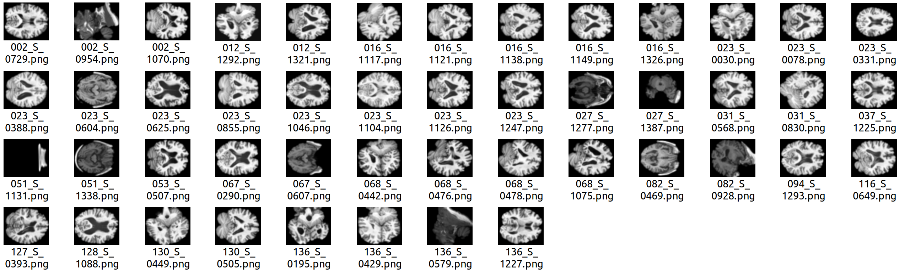
    
  + **RESnet18(Pretrained=True)**
    

